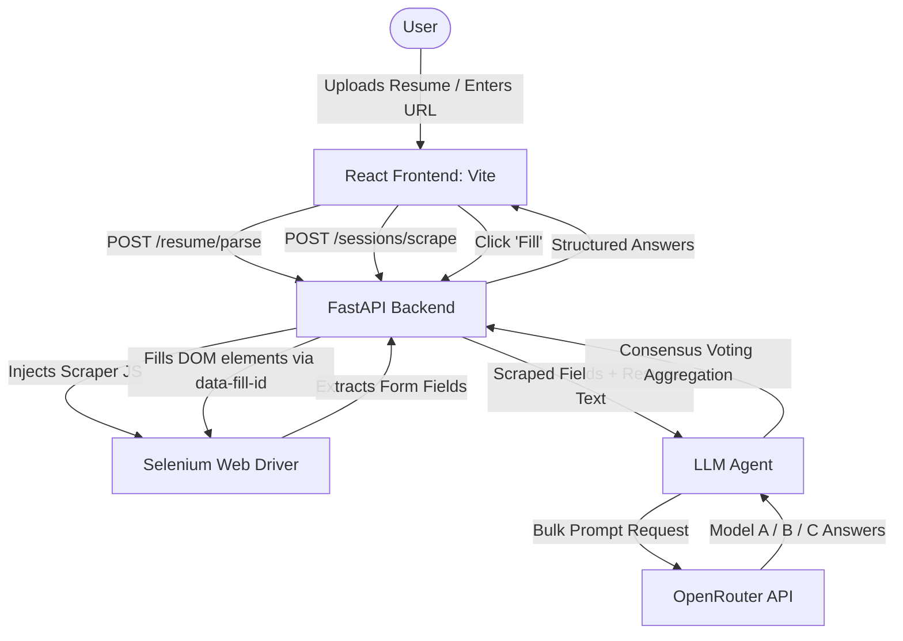

# 🤖 LLM Form Automation Assistant & Job App Filler

An advanced, human-in-the-loop web automation tool powered by LLM consensus voting. It scrapes, processes, and fills arbitrary HTML forms—such as **job applications (Greenhouse, Lever, Workday)**, **Microsoft Forms**, and **Google Forms**—using context extracted directly from your uploaded resume.

---

## ✨ Features

- 📑 **Resume Text Extraction**: Upload a `.pdf` or `.txt` resume to automatically parse and load your profile/facts as context for the LLMs.
- 🧩 **Generic DOM Parser**: Injected JavaScript scraper dynamically identifies standard and custom form elements (`input`, `textarea`, `select` dropdowns, `radio` groups, and `checkbox` grids).
- 🧠 **Bulk Consensus Voting**: Sends the entire form layout and resume context in a single call to multiple open-source LLMs (Qwen, DeepSeek, Gemma, Llama) via OpenRouter. Aggregates model choices using weighted voting consensus for highly accurate answers.
- ⚙️ **One-Click Dockerization**: Fully dockerized environment with containerized Chromium and Chrome Driver. Zero configuration of WebDriver matches or runtime versions needed.
- 🤝 **Human-in-the-Loop Control**: UI allows you to review, edit, or customize generated answers before triggering the Selenium engine to fill the fields. Perfect for handling multi-page forms, logins, and CAPTCHAs.

---

## 🛠️ System Architecture



---

## 🚀 Quick Start (Docker Compose — 1 Minute)

The easiest way to run the entire stack on any machine (macOS, Windows, Linux) is using Docker Compose.

### Prerequisites
- Install **[Docker Desktop](https://www.docker.com/products/docker-desktop/)**

### Steps
1. **Clone the repository**:
   ```bash
   git clone <your-repo-url>
   cd AutomatedFormFiller
   ```

2. **Configure environment variables**:
   Create a `.env` file in the project root directory and add your OpenRouter API key:
   ```env
   OPENROUTER_API_KEY=your_openrouter_api_key_here
   ```

3. **Launch the application**:
   ```bash
   docker compose up --build
   ```

4. **Access the application**:
   Open **[http://localhost:5173](http://localhost:5173)** in your browser.

---

## 💻 Manual Setup (Without Docker)

If you prefer to run the components locally on your host machine:

### 1. Backend Setup
- Navigate to the backend folder and create a virtual environment:
  ```bash
  cd backend
  python3 -m venv venv
  source venv/bin/activate
  pip install -r requirements.txt
  ```
- Create a `.env` file in the `backend/` folder and add your key:
  ```env
  OPENROUTER_API_KEY=your_openrouter_api_key_here
  ```
- Start the server:
  ```bash
  python3 -m uvicorn main:app --port 8000 --reload
  ```

### 2. Frontend Setup
- Navigate to the frontend folder, install npm packages, and start the development server:
  ```bash
  cd ../frontend
  npm install
  npm run dev
  ```
- Open **[http://localhost:5173](http://localhost:5173)**.

---

## 💡 Multi-Page Form Workflow

For forms split into multiple pages/sections:
1. **Start**: Paste the starting URL, click **Open**, click **Scrape**.
2. **Answer & Fill**: Review the aggregated answers, edit any text fields if necessary, and click **Fill**.
3. **Navigate**: In the Selenium browser window that popped up on your screen, click the **Next** button manually (this lets you handle any CAPTCHAs or custom logins).
4. **Reload**: Go back to the dashboard UI and click **Scrape** again. The questions list will reload dynamically with only the fields visible on page 2.
5. **Repeat**: Run the Answer -> Review -> Fill loop for the subsequent pages!
